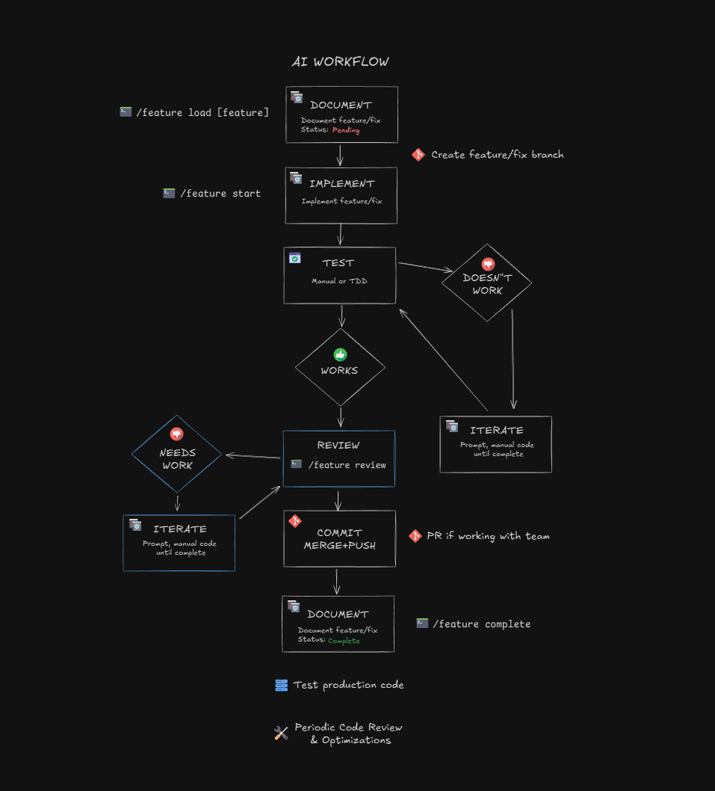

# Automate Current Feature Management With A Command

So right now, we are using this workflow with our AI:


I want to add a new command so we don't have to manually load, start and complete a feature. I also want an argument to do a review of the current feature code. So our workflow will look like this.



You can see the new commands we can run instead of manual prompting for everything.

This is what I want to happen:

1. `/feature load [spec-file.md]` or `feature load a manual prompt` - This will either take a spec file from the **/context/features/** folder or a custom prompt (shorter descriptions) and load it into the **current-feature.md**.
2. `/feature start` - This will implement what is in the **current-feature.md** file. It will create a new branch, create the code for us. After that we will test and iterate.
3. `/feature review` - This will go over all of the code that was created for that feature and make sure that it is correct and did exactly what we want.
4. `/feature explain` - This will list files that were created or changed and explain the code. This is essential to going against vibe coding and understanding what is being done.
5. `/feature complete` - This will mark the feature as complete in the file, merge to main and delete the feature branch.

So this gives us a very smooth workflow that our entire team could use.

## Create The Features Folder

Create a new folder for feature spec files at **/context/features**.

## Create The Feature File

So create a new file at `.claude/commands/feature.md`.

This is a pretty long file so you may want to copy it from the course files.

This is the content:

```markdown
---
description: Manage current feature workflow - start, review, explain or complete
argument-hint: load|start|review|explain|complete
---

## Context

Read the current feature from:
@context/current-feature.md

## File Structure

current-feature.md has these sections:

- `# Current Feature` - H1 heading with feature name when active
- `## Status` - Not Started | In Progress | Complete
- `## Goals` - Bullet points of what success looks like
- `## Notes` - Additional context, constraints, or details from spec
- `## History` - Completed features (append only)

## Task

Execute the requested action: $ARGUMENTS

---

### If action is "load":

1. Check $ARGUMENTS (after "load"):
   - If it looks like a filename (single word, no spaces): Look for `context/features/{name}.md`
   - If it's multiple words: Use as inline feature description, generate goals
   - If empty: Error - "load" requires a spec filename or feature description
2. Update current-feature.md:
   - Update H1 heading to include feature name (e.g., `# Current Feature: Add Navbar`)
   - Write goals as bullet points under ## Goals
   - Write any additional notes/context under ## Notes
   - Set Status to "Not Started"
3. Confirm spec loaded and show the feature summary

---

### If action is "start":

1. Read current-feature.md - verify Goals are populated
2. If empty, error: "Run /feature load first"
3. Set Status to "In Progress"
4. Create and checkout the feature branch (derive name from H1 heading)
5. List the goals

---

### If action is "review":

1. Read current-feature.md to understand the goals
2. Review all code changes made for this feature
3. Check for:
   - ✅ Goals met
   - ❌ Goals missing or incomplete
   - ⚠️ Code quality issues or bugs
   - 🚫 Scope creep (code beyond goals)
4. Final verdict: Ready to complete or needs changes

---

### If action is "explain":

1. Read current-feature.md to understand what was implemented
2. Run `git diff main --name-only` to get list of files changed
3. For each file created or modified:
   - Show the file path
   - Give a 1-2 sentence explanation of what it does / what changed
   - Highlight any key functions, components, or patterns used
4. End with a brief summary of how the pieces fit together

Output format:

## Files Changed

**path/to/file.ts** (new)
Brief explanation of what this file does and why it was added.

**path/to/other.ts** (modified)
What changed and why.

## How It All Connects

Brief summary of the data/control flow between these files.

---

### If action is "complete":

1. Run a final review to ensure everything is complete
2. Stage all changes
3. Commit with a descriptive message based on the feature
4. Push the branch to origin
5. Merge into main
6. Switch back to main branch
7. Reset current-feature.md:
   - Change H1 back to `# Current Feature`
   - Clear Goals and Notes sections
   - Set Status to "Not Started"
8. Add feature summary to the END of History

---

If no action provided, explain the available options: load, start, review, complete
```

If you want to add anything else you can.

## Test The Command

Let's test this out. We will just add a button to the top bar.

Remember, we can either load a file or direct text.

Let's try a file first.

Create a new file at `context/features/new-item-button-spec.md` and add the following:

```markdown
## Create Item Button In Top Bar

## Overview

Create a clean button in the top bar to create a new item.

## Requirements

- Button should be clean
- No functionality yet, just the button itself
- Add a + icon next to the text "New Item"
```

### Load The Feature

Now run the following command in Claude:

```text
/feature load new-item-button-spec.md
```

It should load the requirements to the `current-feature.md` file.

### Start The Feature Implementation

Now run:

```text
/feature start
```

It will add the button. Check it and iterate if needed.

### Explain The Code

Let's have it explain what was done:

```text
/feature explain
```

### Review & Check

Check if all the requirements were met by running:

```text
/feature review
```

It will let you know if the requirements have been met.

### Mark Complete

Now mark as complete:

```text
/feature complete
```

That will close the branch and mark as complete.

Now we have a much cleaner, automated workflow.

You don't have to create a spec file, in fact for something so simple like this, I would just have put the text in the load command.

In the next lesson, I want to talk about subagents.
